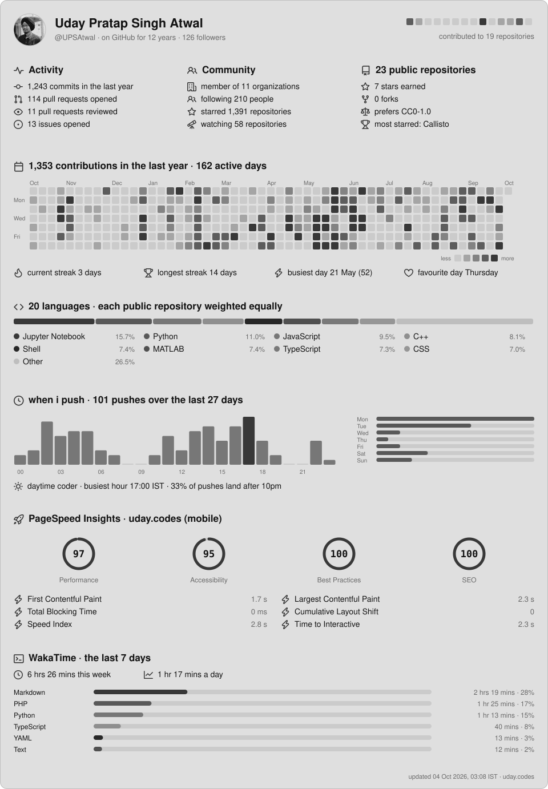

# Uday 

## Github Profile Statistics

<picture>
  <source media="(prefers-color-scheme: dark)" srcset="./metrics-dark.svg">
  <source media="(prefers-color-scheme: light)" srcset="./metrics-light.svg">
  
</picture>

<details>
<summary><h2>Cool Stuff</h2></summary>
<br>
            
```ASCII Art

 github.com/upsatwal            uday.codes            udayatwal.com  


888     888        888                       
888     888        888                       
888     888        888                       
888     888    .d88888    8888b.    888  888 ⠀⠀⠀⠀⠀⠀⠀⠀⠀⠀⠀⠀⠀⠀⢰⡆⠀⠀⠀⠀⠀⠀⠀⠀⠀⠀⠀⠀⠀⠀
888     888   d88" 888       "88b   888  888 ⠀⠀⠀⠀⠀⠀⠀⠀⠀⠀⠀⠀⠀⠀⢸⡇⠀⠀⠀⠀⠀⠀⠀⠀⠀
888     888   888  888   .d888888   888  888 ⠀⠀⠀⠀⣤⣄⠀⠀⠀⠀⢾⡀⠀⠀⠸⠇⠀⠀⢀⡷⠀⠀⠀⠀⣠⣤⠀⠀⠀⠀ 
Y88b. .d88P   Y88b 888   888  888   Y88b 888 ⠀⠀⠀⠀⠈⠻⣷⣄⠀⠀⠈⠁⠀⠀⣀⣀⠀⠀⠈⠁⠀⠀⣠⣾⠟⠁⠀⠀⠀⠀
 "Y88888P"     "Y88888   "Y888888    "Y88888 ⠀⠀⠀⠀⠀⠀⠈⠁⠀⠀⢀⣴⣾⣿⣿⣿⣿⣷⣦⡀⠀⠀⠈⠁⠀⠀⠀⠀⠀⠀
                                         888 ⠀⠀⠀⢠⣤⣀⠀⠀⠀⣴⣿⣿⣿⣿⣿⣿⣿⣿⣿⣿⣦⠀⠀⠀⣀⣤⡄⠀⠀⠀
                                    Y8b d88P ⠀⠀⠀⠀⠀⠁⠀⠀⣼⣿⣿⣿⣿⣿⣿⣿⣿⣿⣿⣿⣿⣧⠀⠀⠈⠀⠀⠀⠀⠀
                                     "Y88P" ⠀⢠⣤⣤⣤⣤⣤⣤⣤⣤⣤⣤⣤⣤⣤⣤⣤⣤⣤⣤⣤⣤⣤⣤⣤⣤⣤⣤⡄⠀
                                            ⠀⠈⠉⠉⠉⠉⠉⠉⠉⠉⠉⠉⠉⠉⠉⠉⠉⠉⠉⠉⠉⠉⠉⠉⠉⠉⠉⠉⠁
            "Sunrise, Parabellum"

```

</details>

